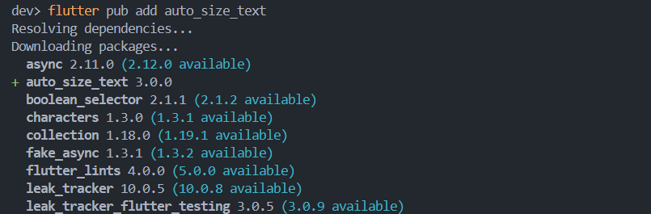
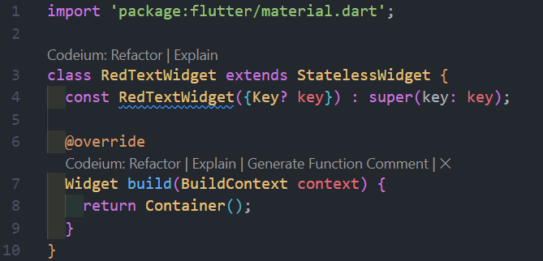
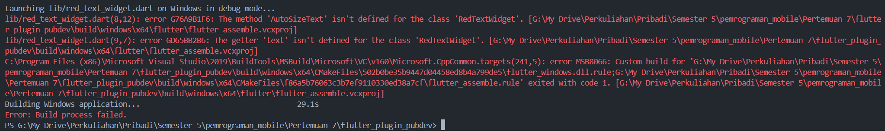
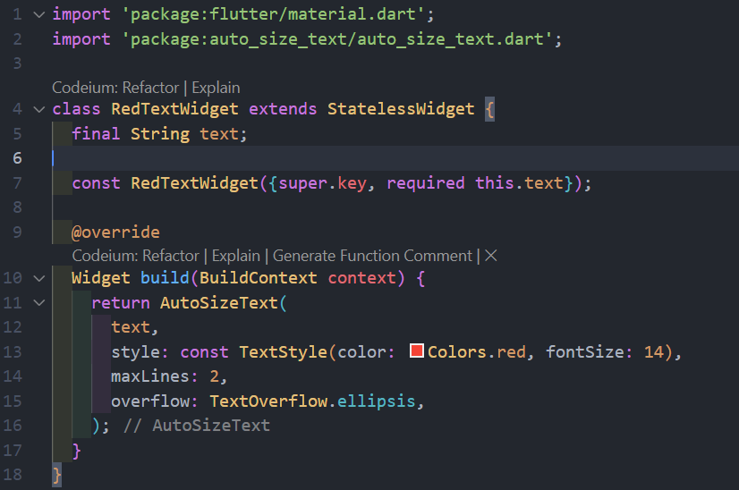

# Praktikum 7

Nama            : Muhammad Rayhan
NIM             : 2241720213
No. Presensi    : 17

## Menambahkan plugin

## Buat file

## Menambahkan Widget AutoSizeText

Teradapt eror karena kita belum mendefinisikan metode AutoSizeText, lebih tepatnya belum mengimpor package auto_text_widget.

Perbaikan

## Hasil Akhir

## Tugas Praktikum
2. Perintah atau prompt tersebut pada terminal bermaksud untuk menginstal paket atau package auto_text_widget. Jika package berhasil diinstal, keterangannya akan muncul di pubspec.yaml

3. Kode tersebut adalah konstruktor dari widget RedTextWidget yang digunakan untuk menginisialisasi properti text yang bersifat final, artinya nilainya tidak bisa diubah setelah diberikan. Konstruktor ini bersifat const, memungkinkan widget di-compile sebagai konstanta, yang membantu optimasi performa. Parameter text bersifat wajib (required) dan diteruskan ke variabel yang digunakan untuk menampilkan teks di widget, sementara super(key: key) meneruskan nilai kunci unik (key) ke konstruktor parent (StatelessWidget) untuk membantu Flutter mengidentifikasi dan mengelola widget dengan lebih efisien.

4. RedTextWidget adalah widget kustom (dibuat sendiri) yang menampilkan teks dengan warna merah (berdasarkan kode yang kita buat di file red_text_widget.dart). Sementara, Text adalah widget bawaan Flutter yang menampilkan teks tanpa modifikasi kustom seperti di RedTextWidget.

5.  - text: parameter yang berisi teks yang akan ditampilkan oleh RedTextWidget. Nilainya diambil dari variabel text
    - style: parameter ini menentukan gaya yang akan diterapkan pada teks. Ini bisa mengatur gaya teks, jenis teks, ketebalan fon, dan warna teks
    - maxLines: parameter ini menentukan jumlah maksimal baris teks yang dapat ditampilkan
    - overflow: parameter ini mengatur bagaimana teks yang melebihi batas maxLines dimuat. Dalam hal ini, jika melebihi batas, teks hanya akan dilanjutkan dengan titik tiga atau elipsis.